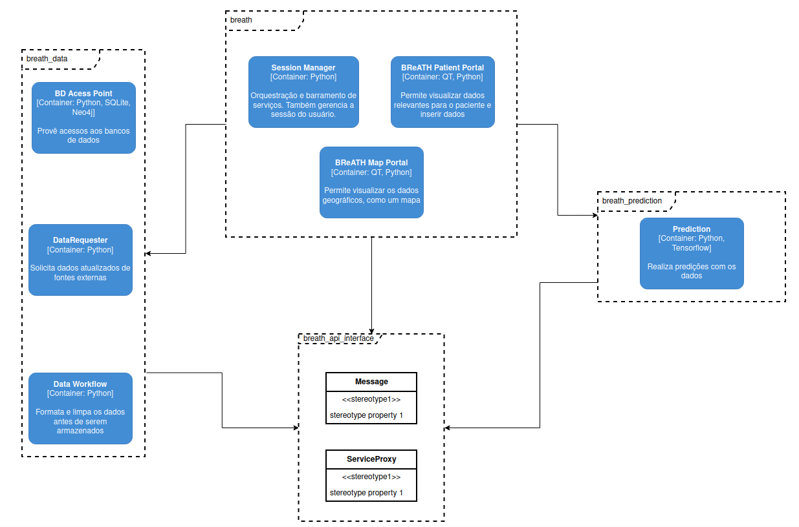
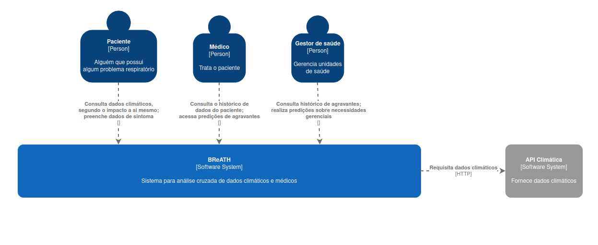
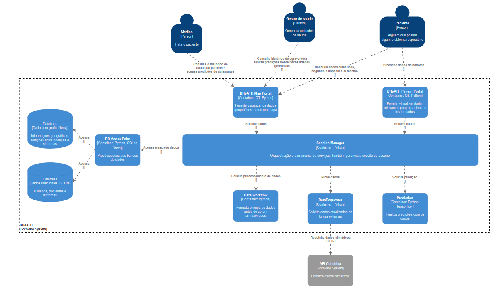
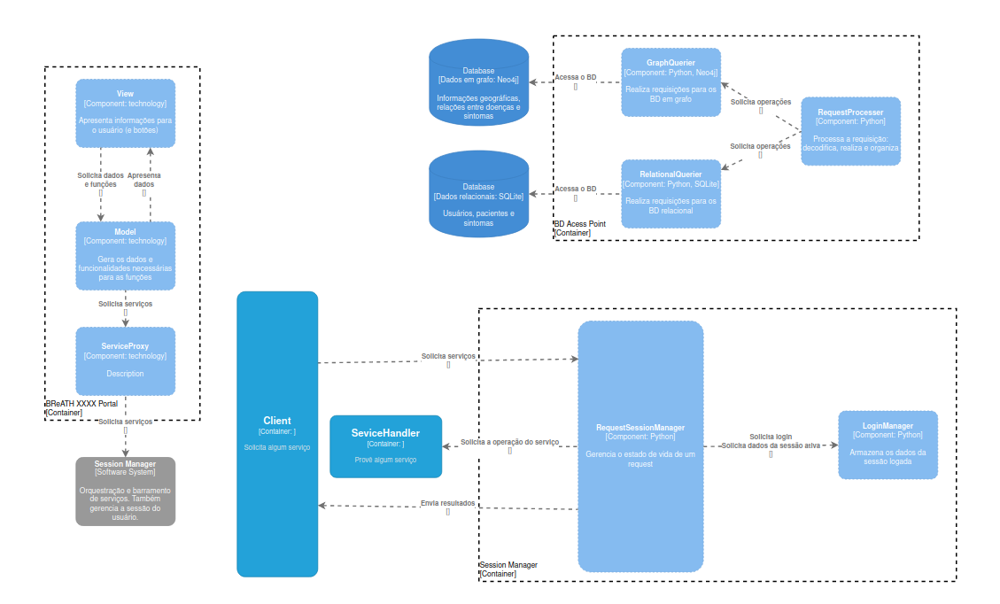
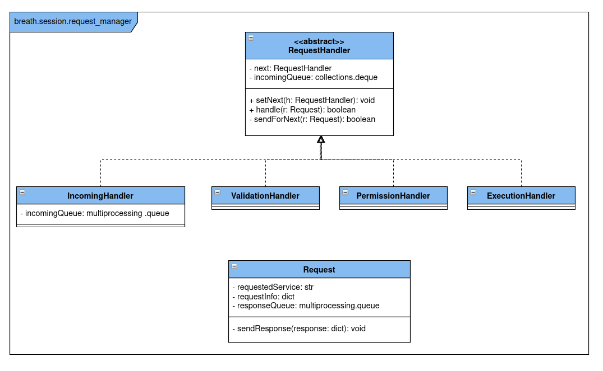

# BReATH - Brazilian Research of Atmosphere Towards Health

BReATH project aims to create a interface to visualize and get insights relating asthma and weather data.

# Authors

- [233840, Elton Cardoso do Nascimento](https://github.com/EltonCN)
- [218733, João Pedro de Moraes Bonucci](https://github.com/Joao-Pedro-MB)
- [240106, Lucas Otávio Nascimento de Araújo](https://github.com/Lucas-Otavio)
- [244712, Thiago Danilo Silva de Lacerda](https://github.com/ThiagoDSL)

# Software architecture

Our software system is architected using C4 and UML diagrams. This repository contains the main application and service management, with other services separated across multiple repositorys, containing our different Python modules. It was divided in this way to help manage the different activities of the disciplines linked to this project.

_PythonModules diagram_
 

## Context
_Context Diagram_
 

This project context consists of 3 stakeholders, the Patient, the Health Manager, and the Physicist/Medic, which have access to 2 different sets of features: the Map visualization and the patient portal. 
The first set consists of an interface with geolocalized information about climate, respiratory diseases, air quality, and history of respiratory diseases through time by city. This service also estimates the number of cases for the following days through the air quality and climate information.
The second set of features show a widget that condensates the information of the climate and air quality. It also shows the consequences of those for the patient's symptoms. Besides offering some tips on how to avoid or mitigate them.
A Session Manager will link the frontend services to the background services of Data workflow, Prediction, and Data requests from exterior sources. In addition, it is responsible for writing and retrieving data from relational and graph databases.

## Container and components

_Container diagram_
 

Our container level describes our **service-oriented architecture**. Each service realizes a set of operations, and is isolated in a different Python process. 

Within the some containers section we also have the component and code level description. We describe only the main and already designed components of the architecture, as some are related to features not yet started.

__Components diagram__

_Containers and Components description_
### Session Manager
This container orchestrates service requests, and handles the login session.

### BReATH Map and Patient Portal:
 These Components have a Layering Structure that wants to be an MVC. Divided into View, the top layer, Model, the middle layer, and a ServiceProxy as the bottom layer and link with the session manager. We used the [Proxy](https://refactoring.guru/pt-br/design-patterns/proxy) Design Pattern because of the service request complexity.

### DataWorflow: 
This container acts as a data formatter and validator before saving it into the database. Regarding this behavior, we used an [Adapter](https://refactoring.guru/design-patterns/adapter) design pattern to clean and reshape the data for the rest of the application.

### DataRequester: 
This container is responsible for requesting and receiving data from external APIs. Due to the possible asynchrony of the task, we used the [Observer](https://refactoring.guru/design-patterns/observer) design pattern to make sure the rest of the application could continue without problems. However, we also decided to implement the [abstract factory](https://refactoring.guru/design-patterns/abstract-factory) design once we could switch APIs or add new ones in the future.

### Prediction:
The Prediction module has an ML model, implemented in TensorFlow, used to predict in real-time the consequences of the climate and air quality over the symptoms and occurrences of respiratory diseases. As this is a central point of the application, it will receive a large number of requests. For this reason, we used a [Proxy](https://refactoring.guru/design-patterns/proxy) Design to help handle those.

### BDAcessPoint:
The access point uses a [factory](https://refactoring.guru/design-patterns/abstract-factory) Design pattern for the two possible databases to make the queries faster. The Design is divided through the GraphQuerier, RelationalQuerier, and RequestProcessor, which is the factory controller.

#### RequestSessionManager
Handles the lifecycle of a request, from receiving it to sending its response.
We used the [Chain of Responsibility](https://refactoring.guru/pt-br/design-patterns/chain-of-responsibility) design pattern to create it, as can be seen on its code diagram. Because we use Python, which supports multiple inheritance, we use an abstract class, as there is no difference between it and an interface.

__Code diagram__

## ???

Description

- RequestProcesser:
- GraphQuerier:
- RelationalQuerier:

### Databases:
- SQL: 
- Graph: 

